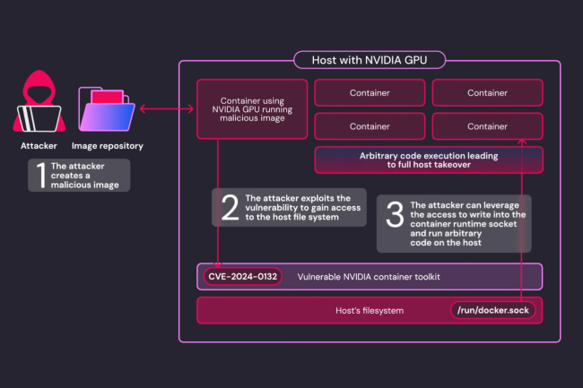

# Nvidia corrige une vulnérabilité critique dans son Container Toolkit

**Publié le 30 septembre 2024**

Nvidia a récemment corrigé une vulnérabilité critique dans son outil de conteneurisation, **Container Toolkit**. Cette faille permettait à un attaquant d'exécuter du code à distance et de provoquer un déni de service, affectant les environnements exploitant le GPU pour des applications d'intelligence artificielle (IA) et d'apprentissage machine. 

## Détails de la faille critique

Autrefois connu sous le nom de **Nvidia Docker**, le service **Nvidia Container Toolkit (NCT)** contenait une vulnérabilité majeure, référencée sous le **CVE-2024-0132** avec un score de gravité de **9 sur 10** selon l'échelle CVSS. Cette vulnérabilité permettait à un utilisateur ou une application malveillante de s'évader de leur conteneur isolé et de prendre le contrôle total de l’hôte sous-jacent.

Nvidia a décrit cette faille comme une vulnérabilité **TOCTOU (Time-of-check Time-of-Use)** qui survient lorsque le programme vérifie une condition puis en utilise les résultats sans s'assurer que la condition n'a pas changé entre temps. Cette vulnérabilité affecte les versions de **Nvidia Container Toolkit jusqu'à la version 1.16.1** incluse. Les détails techniques de l'exploitation n'ont pas été divulgués pour des raisons de sécurité.

---

## Exploitation potentielle et impact

Les chercheurs de **Wiz Research**, qui ont découvert la faille, expliquent qu'un attaquant contrôlant une image de conteneur malveillante peut exploiter cette faille pour échapper au conteneur et obtenir un accès complet à l’hôte. Ce type d'attaque peut se produire directement par le biais de services utilisant des ressources GPU partagées ou via des chaînes d'approvisionnement compromises.

L'attaque repose sur une condition de concurrence. « L'attaquant crée une image spécifiquement conçue pour exploiter la faille **CVE-2024-0132** », ont détaillé les chercheurs dans leur blog. « L'attaquant exécute ensuite l’image malveillante, soit directement, soit via une ingénierie sociale en incitant un utilisateur à exécuter une image d'IA non fiable. »

---

## Correctifs et recommandations

Nvidia a publié un correctif pour cette vulnérabilité. Tous les utilisateurs de Nvidia Container Toolkit sont invités à **mettre à jour vers la version la plus récente**. La faille peut être particulièrement dangereuse dans des environnements de calcul partagés comme **Kubernetes**, où un conteneur malveillant pourrait échapper à son isolation et accéder aux données d'autres applications exécutées sur le même nœud.

**Wiz Research** a également averti que cette vulnérabilité pourrait affecter jusqu'à **35 % des environnements cloud** qui utilisent Nvidia Container Toolkit pour l'accès au GPU. « Cette bibliothèque est préinstallée dans de nombreuses plateformes d'IA et environnements virtuels », ont précisé les chercheurs.

Toutefois, Nvidia a indiqué que la faille **n'affecte pas** les cas d'usage impliquant l'interface **CDI (Container Device Interface)**.

---

## Sources

- [Le Monde Informatique](https://www.lemondeinformatique.fr/actualites/lire-docker-augmente-le-prix-de-ses-abonnements-pro-et-team-94719.html)
